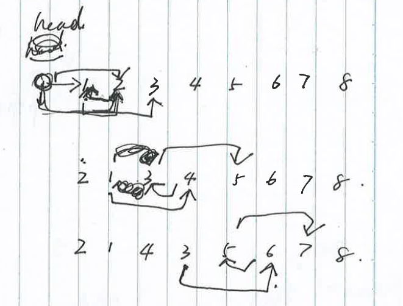

## 19. 删除链表的倒数第 N 个结点
[网址](https://leetcode-cn.com/problems/remove-nth-node-from-end-of-list/)

* 思路1（自己的实现）
遍历一遍得到 length，第二次从头走 length - N

* 思路2
两个指针 fast slow, fast先走n步，然后fast和slow一起走

* 思路3
递归思路，recursive(head.next, N), 递归第N次


## 24. 两两交换链表中的节点
[网址](https://leetcode-cn.com/problems/swap-nodes-in-pairs/)

* 思路1 （自己的实现）

解这种规律题，尽量用中间的节点来演算思路，因为头节点和尾节点都是边界值，不利于演算规律。



```
/**
 * Definition for singly-linked list.
 * function ListNode(val, next) {
 *     this.val = (val===undefined ? 0 : val)
 *     this.next = (next===undefined ? null : next)
 * }
 */
/**
 * @param {ListNode} head
 * @return {ListNode}
 */
var swapPairs = function(head) {
    if (!head || !head.next) {
        return head;
    }
    const newHead = new ListNode(0, head);

    let current = newHead;
    let last;
    while(current.next  && current.next.next) {
        last = current.next;
        current.next = current.next.next;
        last.next = current.next.next;
        current.next.next = last;

        current = last;
    }

    return newHead.next;
};
```

* 思路2 

**递归** 

感觉现在没有形成递归的思想，所以总是想不起来用递归。不过递归需要压栈，如果数据无穷，有溢出风险。
[递归参考博客](https://lyl0724.github.io/2020/01/25/1/)


```
// @mata川
//
// 使用递归来解决该题，主要就是递归的三部曲：
//
// 找终止条件：本题终止条件很明显，当递归到链表为空或者链表只剩一个元素的时候，没得交换了，自然就终止了。
// 找返回值：返回给上一层递归的值应该是已经交换完成后的子链表。
// 单次的过程：因为递归是重复做一样的事情，所以从宏观上考虑，只用考虑某一步是怎么完成的。我们假设待交换的俩节点分别为head和next，next的应该接受上一级返回的子链表(参考第2步)。
// 就相当于是一个含三个节点的链表交换前两个节点，就很简单了，想不明白的画画图就ok。
class Solution {
    public ListNode swapPairs(ListNode head) {
        if(head == null || head.next == null){
            return head;
        }
        ListNode next = head.next;
        head.next = swapPairs(next.next);
        next.next = head;
        return next;
    }
}
```
## 61. 旋转链表
[网址](https://leetcode-cn.com/problems/rotate-list/)

* 思路1

遍历一遍得到length， k % length 得到真正的移动个数

思路1的结果不好，执行用时：108 ms, 在所有 JavaScript 提交中击败了26.27%的用户， 内存消耗：39.8 MB, 在所有 JavaScript 提交中击败了11.52%的用户
```
/**
 * Definition for singly-linked list.
 * function ListNode(val, next) {
 *     this.val = (val===undefined ? 0 : val)
 *     this.next = (next===undefined ? null : next)
 * }
 */
/**
 * @param {ListNode} head
 * @param {number} k
 * @return {ListNode}
 */
var rotateRight = function(head, k) {
    if (!head || !head.next) return head;

    let length = 1;
    let current = head;
    while(current.next) {
        length++
        current = current.next;
    }
    
    let step = k % length;
    if (step === 0) {
        return head;
    }

    current.next = head;    // 构成循环链
    current = head.next;
    for (let i = 0; i < length - step - 1; i++) {
        current = current.next;
        head = head.next;
    }
    head.next = null;
    return current;
};
```

* 思路2

想起来前几天做的两个指针fast 和 slow，感觉是一个思路。
最后优化了下，发现整体还是一个思路。
```
/**
 * Definition for singly-linked list.
 * function ListNode(val, next) {
 *     this.val = (val===undefined ? 0 : val)
 *     this.next = (next===undefined ? null : next)
 * }
 */
/**
 * @param {ListNode} head
 * @param {number} k
 * @return {ListNode}
 */
var rotateRight = function(head, k) {
    if (!head || !head.next || k === 0) return head;

    let length = 1;
    let fast = head;
    while (fast.next) {
        fast = fast.next;
        length++;
    }

    fast.next = head; // 循环
    let step = length - k % length;
    while(step > 1) {
        head = head.next;
        step--;
    }
    fast = head.next;
    head.next = null;
    return fast;
};
```


